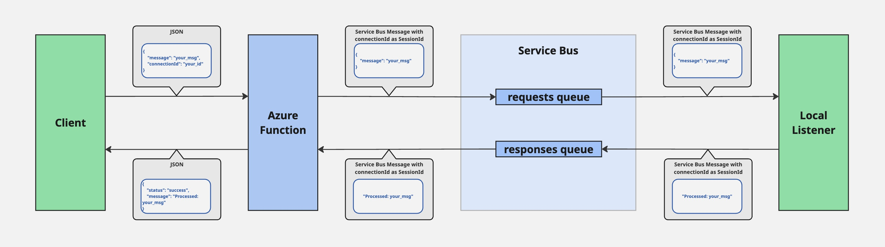

# Azure Relay Function for DataMigratePro 🚀

This repository contains the Azure Function **SendToDMP**, which serves as a secure relay between Business Central SaaS and a local DataMigratePro client, utilizing Azure Service Bus with session-based communication.

<br>

## Function Description

- The Azure Function receives payloads (JSON data) via an HTTP POST request.
- The received data is forwarded via an Azure Service Bus with session-based communication to the local client **DataMigratePro.exe**.
- The local client (listener) processes the data and performs further actions (e.g., save, forward, etc.).

<br>

## Component Overview

| Component | Description |
|:--|:--|
| **Azure Function (this repo)** | Mediates data from Business Central to DataMigratePro.exe |
| **Business Central Extension** | Sends payloads via HTTP POST to the Azure Function |
| **Local Program (Listener)** | Receives payloads from the relay and processes them |

<br>

## Dependent Repositories

- **[DataMigratePro-BC (Business Central Sender)](https://github.com/IOIntegrated/DataMigratePro-BC.git)**
 → Extension in Business Central for data transfer.
- **[DataMigratePro (Local Listener)](https://github.com/IOIntegrated/DataMigratePro/tree/preproduction)**
 → Local C# program that processes incoming data.

<br>

## Installation / Deployment

Deploying Azure Function to Azure

### Prerequisites

* Azure Subscription
* Azure CLI (`az`)
* Azure Functions Core Tools (`func`)

### Steps

1. **Log in to Azure:**

```bash
az login
```

2. **Create Azure Function App (if not exists):**

```bash
az functionapp create \
  --resource-group <your_resource_group> \
  --consumption-plan-location <region> \
  --runtime dotnet-isolated \
  --functions-version 4 \
  --name <your_function_name> \
  --storage-account <your_storage_account>
```

3. **Set Environment Variables for Function App:**

```bash
az functionapp config appsettings set --name <your_function_name> --resource-group <your_resource_group> --settings \
  ServiceBusConnectionString="<your_servicebus_connection_string>" \
  RequestQueueName="requests" \
  ResponseQueueName="responses"
```

4. **Deploy Azure Function:**

```bash
func azure functionapp publish <your_function_name>
```

5. **Verify Deployment:**

* Check the Function App in Azure portal.
* Monitor logs using Application Insights or Azure Logs.
* Test HTTP endpoint using Postman or Business Central.

### Example Call to Deployed Function:

```http
POST https://<your_function_name>.azurewebsites.net/api/SendToDMP
Content-Type: application/json

{
  "message": "test message",
  "connectionId": "your-connection-id"
}
```

<br>

## Overview Diagram



<br>

## Local Development

To test the **SendToDMP** Azure Function locally:

### 1. Prerequisites

* [.NET 8 SDK](https://dotnet.microsoft.com/)
* [Azure Functions Core Tools](https://learn.microsoft.com/en-us/azure/azure-functions/functions-run-local)

Install via npm if needed:

```bash
npm install -g azure-functions-core-tools@4 --unsafe-perm true
```

### 2. Configure Local Settings

Update `local.settings.json` in the project root:

```json
{
  "IsEncrypted": false,
  "Values": {
    "AzureWebJobsStorage": "UseDevelopmentStorage=true",
    "FUNCTIONS_WORKER_RUNTIME": "dotnet-isolated",
    "ServiceBusConnectionString": "<your_service_bus_connection_string>",
    "RequestQueueName": "requests",
    "ResponseQueueName": "responses"
  }
}
```

Replace `<your_service_bus_connection_string>` with your Service Bus connection string.

### 3. Run Locally

In the project directory:

```bash
func start
```

This will launch the **SendToDMP** function at:

```
http://localhost:7071/api/SendToDMP
```

You can test it using Postman, curl, or Business Central HTTP calls.

Example request body:

```json
{
  "message": "example message",
  "connectionId": "your-connection-id"
}
```

### 4. Logs and Debugging

* Logs will appear in the terminal during execution.
* Ensure the listener for the same `connectionId` is running to receive responses.

<br>

## Security Considerations

### 1. Traffic Encryption

> “Azure Service Bus or Azure Event Hubs requires the use of TLS at all times. It supports connections over TCP port 5671, whereby the TCP connection is first overlaid with TLS before entering the AMQP protocol handshake...”  
> [Source – Microsoft Docs](https://learn.microsoft.com/en-us/azure/service-bus-messaging/service-bus-amqp-protocol-guide)

### 2. Authentication

> “Microsoft Entra integration with Service Bus provides role-based access control (RBAC)… Authorizing users or applications using an OAuth 2.0 token returned by Microsoft Entra ID provides superior security and ease of use over shared access signatures (SAS). With Microsoft Entra ID, there’s no need to store tokens in your code…”  
>
> “Service Bus REST API supports OAuth authentication with Microsoft Entra ID.”  
> [Source – Microsoft Docs](https://learn.microsoft.com/en-us/azure/service-bus-messaging/service-bus-authentication-and-authorization)

### 3. Access Control

> “SAS authentication enables you to grant a user access… by presenting a SAS token, which consists of the resource URI being accessed and an expiry signed with the configured key.”  
>
> In addition, access can be controlled using IP filtering, Virtual Networks, and Private Endpoints.  
> [Source – Microsoft Docs](https://learn.microsoft.com/en-us/azure/service-bus-messaging/service-bus-ip-filtering)

### 4. Azure-Level Protection

> “Microsoft Azure, Dynamics 365, and other Microsoft online services undergo regular independent third-party audits for ISO/IEC 27001 compliance.”  
> [Source – Microsoft Docs](https://learn.microsoft.com/en-us/azure/compliance/offerings/offering-iso-27001)

<br>

## Troubleshooting

- **Check Azure Function Logs:**
  Use Azure portal or `func start` console logs when running locally to monitor incoming requests and Service Bus operations.
- **Monitor Azure Service Bus:**
  Use Azure Service Bus metrics in the Azure portal to track messages, active sessions, and delivery counts.
- **Verify Local Listener:**
  Ensure the **Local Listener** is running and initialized with the correct `connectionId`.
  If Listener isn’t running for the given SessionId, Azure Function will fail to receive the response.
- **Session Lock Issues:**
  Azure Function will return errors if multiple Function calls try to use the same `connectionId` concurrently. Each connectionId (SessionId) can only be locked by one receiver at a time.
- **Check for Session Timeouts:**
  Messages will remain in the queue until the correct Listener connects and processes them. Check queue length in Azure Portal.
- **Application Insights (Optional):**
  Use Application Insights for advanced monitoring of Azure Function events and dependencies.
- **Test using Postman / Test Client:**
  Send test requests to the Function endpoint to verify that routing and responses work.

<br>

## License

© 2025 IO Integrated GmbH & Co. KG
